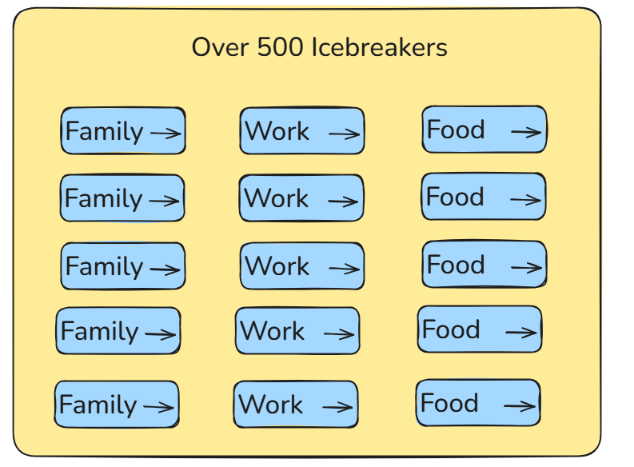
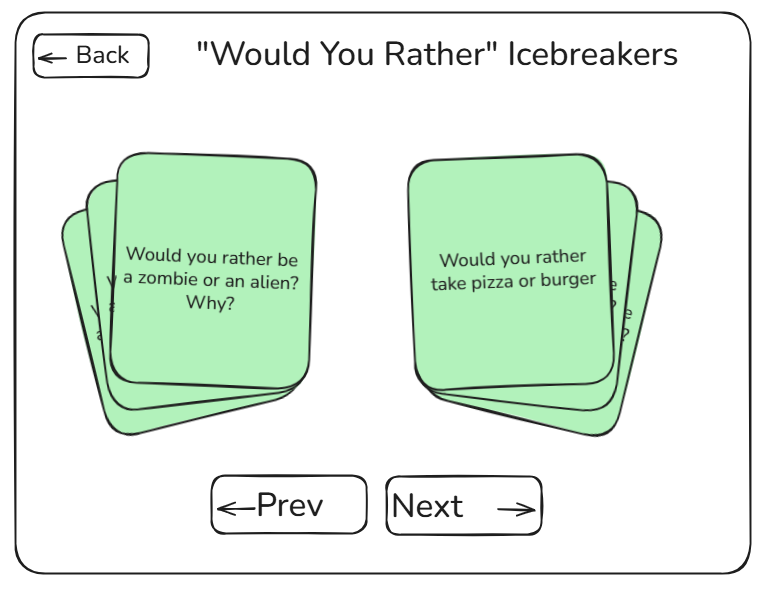
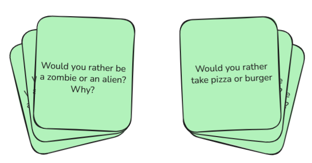
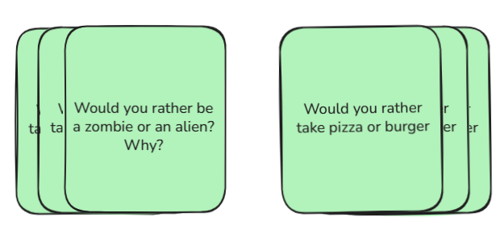

# Icebreaker App - Project Overview

An icebreaker is a short, engaging activity or question designed to spark conversation, build connection, and create a comfortable atmosphere within a group. Icebreakers help people open up, learn about one another, and strengthen team cohesion, especially in environments where collaboration and communication matter.

As a team, you’ll be experiencing icebreakers regularly, particularly during your daily scrum (standup meetings). These quick moments at the start of a meeting can shift the energy, increase participation, and remind everyone that we’re not just teammates—we’re humans working together.

In this challenge, your mission is to design and build an Icebreaker App that makes running icebreakers effortless, engaging, and genuinely enjoyable.

And here’s the twist, this won’t just be a demo project. **You’ll actually use this app throughout your sessions.**

Every time a standup kicks off with an icebreaker powered by your own product, you’ll feel it. That small moment of "we built this." That quiet confidence when something works smoothly because you designed it that way.

- That's real ownership.
- That's real impact.

And by the way, in the past, everyone has been answering same icebreaker question, with this app, each member can answer their own icebreaker question(s), how powerful is that.

## Technical Scope and Constraints

For this challenge, you will be building the Icebreaker App as a frontend-only application.

Let’s be clear:

- **No** servers.
- **No** databases.
- **No** backend APIs.
- **No** Backend-as-a-Service platforms (including tools like Supabase, Firebase, or anything similar).

This is intentionally a pure frontend project.

You must build the application using:

- React or Angular
- Any complementary frontend tools or libraries (UI frameworks, component libraries, state management tools, routing libraries, etc.)

## Home Page - Category Selection

The homepage is the entry point of the Icebreaker App. Its primary purpose is to allow users to quickly browse and select from a variety of icebreaker categories.

The homepage must include at least 15 different icebreaker categories. Each category should be represented as a clearly styled button as shown in the image below:



Examples of possible categories:

- Work
- Family
- Food
- Travel
- Fun
- Would You Rather
- Hypotheticals
- Childhood
- Goals
- Random
- Team Building
- Favorites
- This or That
- Productivity
- Pop Culture

You are free to define and design your own categories as long as there are at least 15 categories. Each category has at least 30 icebreakers.

**[IMPORTANT]: Each category should have at least 30 icebreakers questions**

When a user clicks on a category, they should be redirected to the page below.

## Category Page - Icebrekers Viewer

The Category Page displays the icebreakers for a selected category.

The layout should include:

- A **Back Button** positioned to the top-left corner, clicking on this button must return the user to the homepage (category selection page)..
- A clear category title at the top e.g., "Would You Rather... Icebreakers"
- A central card display area
- Navigation controls ("Previous" and "Next") at the bottom.



Note:

- All cards are stacked visually
- The active card appears on the right side by default
- Additional cards may be slightly visible behind to indicate a stack.

You card could be stacked in any of the following formats:





Or whichever way you choose to stack the cards, you get the idea.

Important:

Users should be able to navigate between the icebreaker cards in two ways:

1. **Drag Interaction (Primary Interaction)**

- Cards must be draggable.
- The user can drag a card from right to left to reveal the next card.
- The motion should feel smooth and natural.
- The interaction should mimic a swipe-style experience.

2. **Button Navigation (Alternative Interaction)**

- A **Previous** button navigates to the previous icebreaker.
- A **Next** button navigates to the next icebreaker.

## Follow Ups

- Should the icebreakers be randomized each time a category is opened, so the experience feels fresh and unpredictable?
- Should each card movement trigger a subtle "card click" sound effect?
- [Optional] should there be a shuffle button within a category? Instead of randomizing the entry, maybe users can reshuffle the deck at anytime.

# Project Setup

## React + TypeScript + Vite

This template provides a minimal setup to get React working in Vite with HMR and some ESLint rules.

Currently, two official plugins are available:

- [@vitejs/plugin-react](https://github.com/vitejs/vite-plugin-react/blob/main/packages/plugin-react) uses [Oxc](https://oxc.rs)
- [@vitejs/plugin-react-swc](https://github.com/vitejs/vite-plugin-react/blob/main/packages/plugin-react-swc) uses [SWC](https://swc.rs/)

## React Compiler

The React Compiler is not enabled on this template because of its impact on dev & build performances. To add it, see [this documentation](https://react.dev/learn/react-compiler/installation).

## Expanding the ESLint configuration

If you are developing a production application, we recommend updating the configuration to enable type-aware lint rules:

```js
export default defineConfig([
  globalIgnores(['dist']),
  {
    files: ['**/*.{ts,tsx}'],
    extends: [
      // Other configs...

      // Remove tseslint.configs.recommended and replace with this
      tseslint.configs.recommendedTypeChecked,
      // Alternatively, use this for stricter rules
      tseslint.configs.strictTypeChecked,
      // Optionally, add this for stylistic rules
      tseslint.configs.stylisticTypeChecked,

      // Other configs...
    ],
    languageOptions: {
      parserOptions: {
        project: ['./tsconfig.node.json', './tsconfig.app.json'],
        tsconfigRootDir: import.meta.dirname,
      },
      // other options...
    },
  },
])
```

You can also install [eslint-plugin-react-x](https://github.com/Rel1cx/eslint-react/tree/main/packages/plugins/eslint-plugin-react-x) and [eslint-plugin-react-dom](https://github.com/Rel1cx/eslint-react/tree/main/packages/plugins/eslint-plugin-react-dom) for React-specific lint rules:

```js
// eslint.config.js
import reactX from 'eslint-plugin-react-x'
import reactDom from 'eslint-plugin-react-dom'

export default defineConfig([
  globalIgnores(['dist']),
  {
    files: ['**/*.{ts,tsx}'],
    extends: [
      // Other configs...
      // Enable lint rules for React
      reactX.configs['recommended-typescript'],
      // Enable lint rules for React DOM
      reactDom.configs.recommended,
    ],
    languageOptions: {
      parserOptions: {
        project: ['./tsconfig.node.json', './tsconfig.app.json'],
        tsconfigRootDir: import.meta.dirname,
      },
      // other options...
    },
  },
])
```
